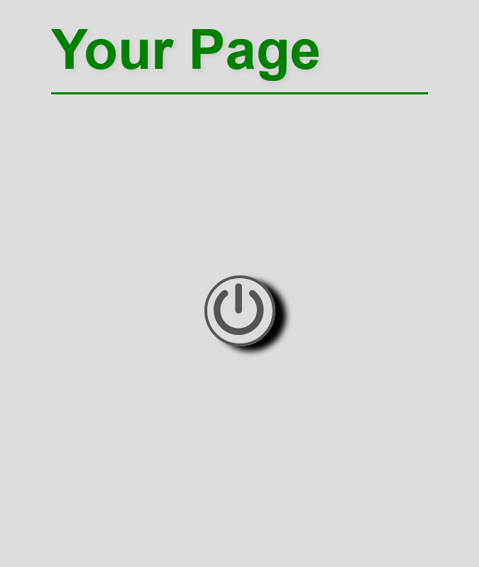
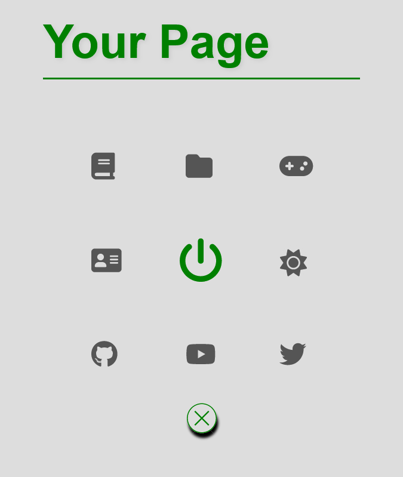

# animated_pop-up_navbar

 animated pop up navbar only HTML, CSS, JS

Copy the folder *navbar* and open *index.html* in your browser.

--------------------------------------------------
## Icons !!!
The icons can be found at https://fontawesome.com/. These can either be downloaded or inserted via script. Please visit https://fontawesome.com/ to use them (e.g. `<i class="fa fa-moon"></i>`).
Without the icons the navbar is not really usable. But the icons can of course also be replaced by e.g. your own images, etc.

-------------------------------------------------

Preview

  

